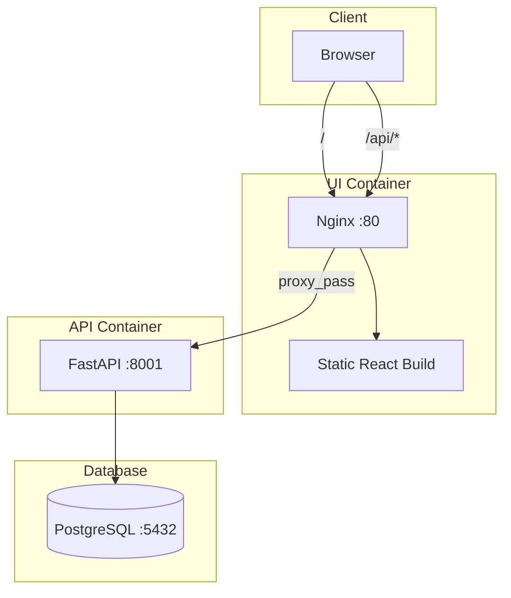

# Architecture

## System Overview

The Loan Agent MVP is a three-tier application: React UI, FastAPI backend, and PostgreSQL database.



- **UI** serves the React SPA and proxies `/api/*` to the API. Same-origin requests avoid CORS.
- **API** connects to Postgres via `loan_agent.db.get_conn()`.
- **Docker Compose**: postgres (5432), api (8001), ui (80). pgAdmin is optional (`--profile tools`).

## Agent Primitives

From `Loan_Agent/Architecture.md` and `Project-plan/Agent.md`:

| Primitive | Purpose |
|-----------|---------|
| **Agent** | Orchestrates underwriting evaluation. |
| **Runner** | Deterministic: fixed tool order. Autonomous: `runner_autonomous.py` drives ReAct loop. |
| **Router** | Selects next tool from `tool_horizon`; respects tool dependencies (e.g. list loans before collateral). |
| **Context** | `AgentContext` holds user input, intent, planning, tool history, signals, policy decision, trace. |
| **Tool** | Registered functions (credit risk, cashflow, loans, collateral) executed via `tool_registry`. |
| **StateMachine** | `run_react_loop` orchestrates node sequence; calls `_run_tool_with_retry`. |
| **RetryEngine** | Each tool execution has 2 attempts; failure propagates to Observation. |
| **Tool Registry** | Dynamic discovery: `register_tool`, `list_tools`, `execute_tool`, `to_openai_function_tools`. |

## Directory Layout

```
Loan_Agent/
├── loan_agent/
│   ├── agent/           # Context, policy, runners, state machine, nodes
│   ├── api/             # FastAPI server
│   ├── tools/           # Four underwriting tools
│   ├── tool_registry.py
│   ├── db.py, config.py, applicants.py
├── loan-ui/             # React + Vite
├── DB/                  # init.sql, seed_test_cases.sql
├── docker-compose.yaml
├── Dockerfile.api
└── DEPLOY.md
```
