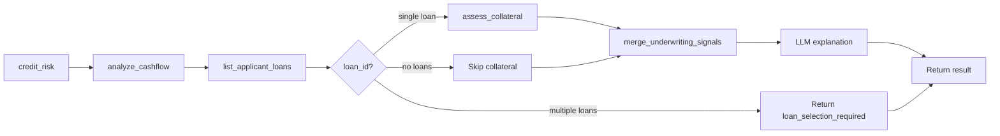
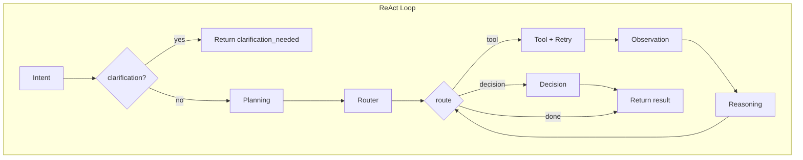

# Execution Flow

## Deterministic Mode

Implemented in `loan_agent/agent/runner.py`. Fixed tool order:

1. **calculate_credit_risk** with `applicant_id`
2. **analyze_cashflow** with `applicant_id`, `months`
3. **list_applicant_loans** with `applicant_id`
4. If multiple loans and no `loan_id`: return early with `loan_selection_required=True`
5. If single loan and no `loan_id`: use that loan; else use provided `loan_id`
6. **assess_collateral** with `loan_id` (if applicable)
7. **merge_underwriting_signals** → overall_risk_level, recommendation, explanation
8. LLM generates human-readable explanation and outcome analysis
9. Return `UnderwritingAgentOutput` as dict

Each tool is executed with `_run_tool_with_retry` (2 attempts). Failures set `tool_failed`, populate `missing_data`, and use fallback values for the policy merge.

## Autonomous Mode

Implemented in `loan_agent/agent/state_machine.py` (`run_react_loop`) and `runner_autonomous.py`.

### Step-by-Step

1. **Intent** (`run_intent_node`): Parse `user_request`; extract `applicant_id`, `loan_id`, `months`. If `applicant_id` missing → `clarification_required=True`, return to client.
2. **Planning** (`run_planning_node`): Set `tool_horizon` (eligible tools).
3. **Loop** (until `goal_met`, `max_steps`, or Router returns decision):
   - **Router** (`run_router_node`): Pick next tool from horizon not yet in `tool_history`. If collateral needed but no `loan_id`, ensure `list_applicant_loans` runs first; store `_loan_id` in signals.
   - **Tool**: `_run_tool_with_retry(name, args)` → 2 attempts.
   - **Observation** (`run_observation_node`): Append to `tool_history`; update `signals`.
   - **Reasoning** (`run_reasoning_node`): LLM analyzes; may set `goal_met`, `confidence`.
4. **Decision** (`run_decision_node`): Call `merge_underwriting_signals`; set `policy_decision`; generate `llm_explanation` and `llm_outcome_analysis`.

### Clarification Resume

- **Direct entity reply** (UUID or single customer name): Update `intent.entities`; `run_react_loop(..., skip_intent=True)` from Planning.
- **Open-ended reply**: Append to `user_request`; re-run Intent; if no clarification, continue from Planning.

### Customer Chat Flow

- `intent_type="customer_chat"`; entities include `applicant_id`.
- Skip Intent; run Planning → Router → Tool → Observation → Reasoning loop.
- Decision node produces `chat_answer` (natural language) instead of full underwriting output.
- `max_steps` typically 4 for chat.

## Policy Merge

`merge_underwriting_signals` in `loan_agent/agent/policy.py`:

- Maps credit `risk_level`, cashflow `recommendation`, collateral `collateral_status` to numeric bands.
- Takes **max** risk across signals.
- **Recommendation**: high → decline; medium → conditional; low → approve. Tool failure → conditional.
- Returns `(overall_risk_level, recommendation, explanation, missing_data)`.
